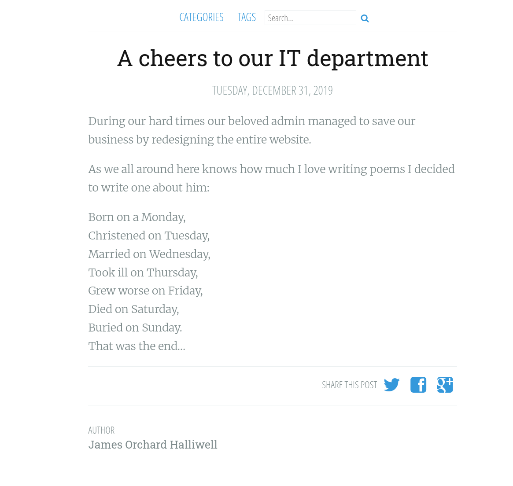
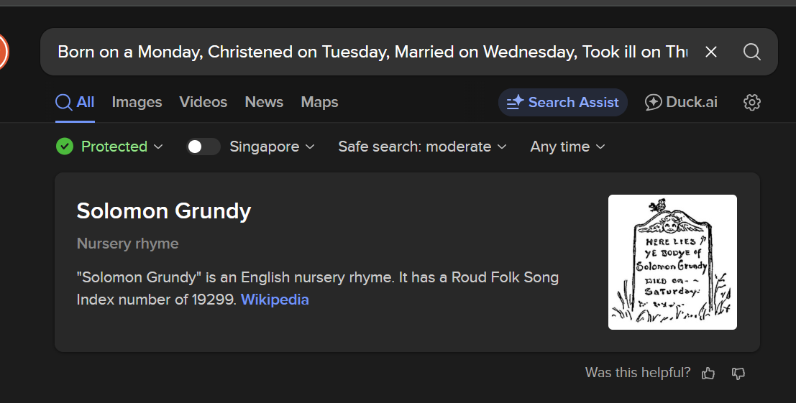
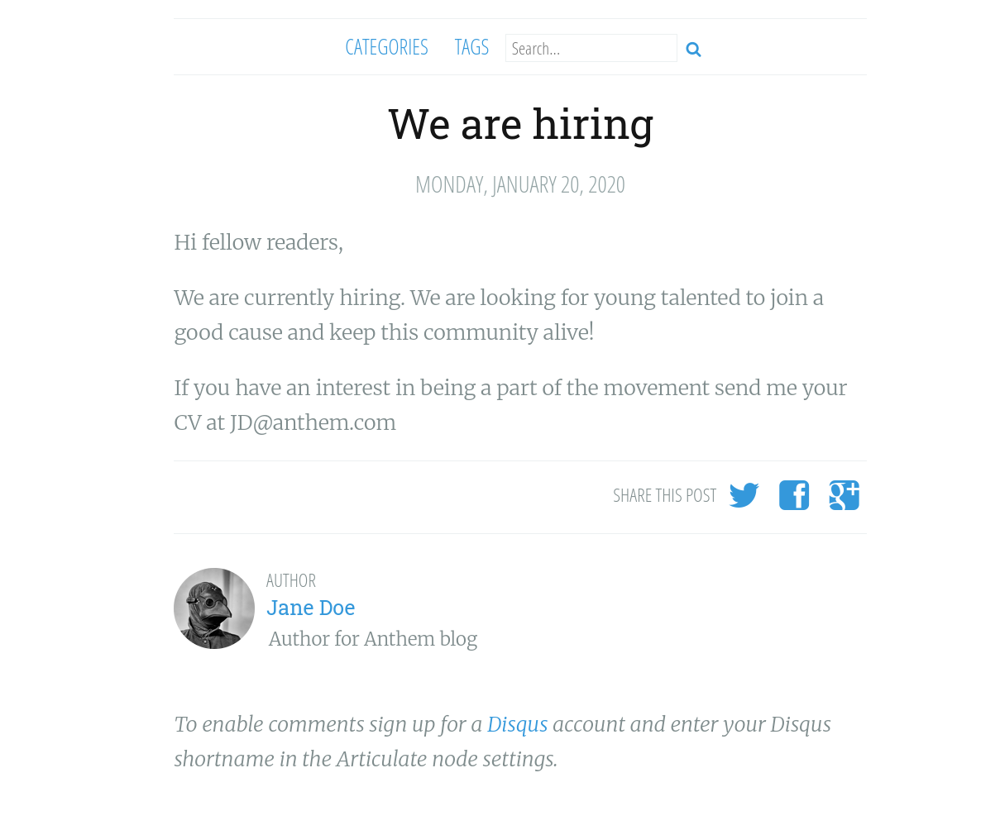
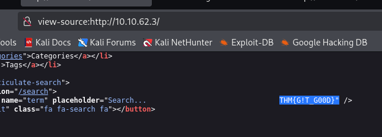
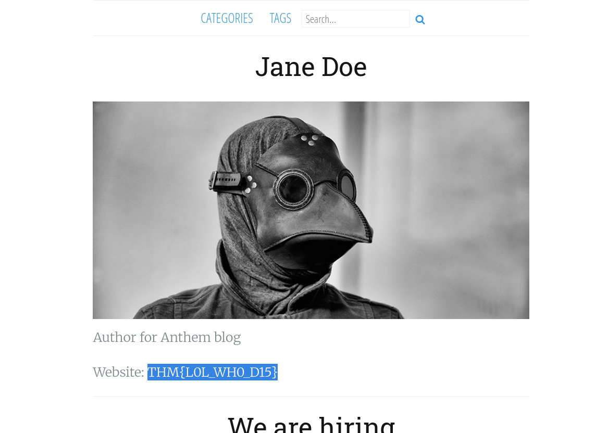
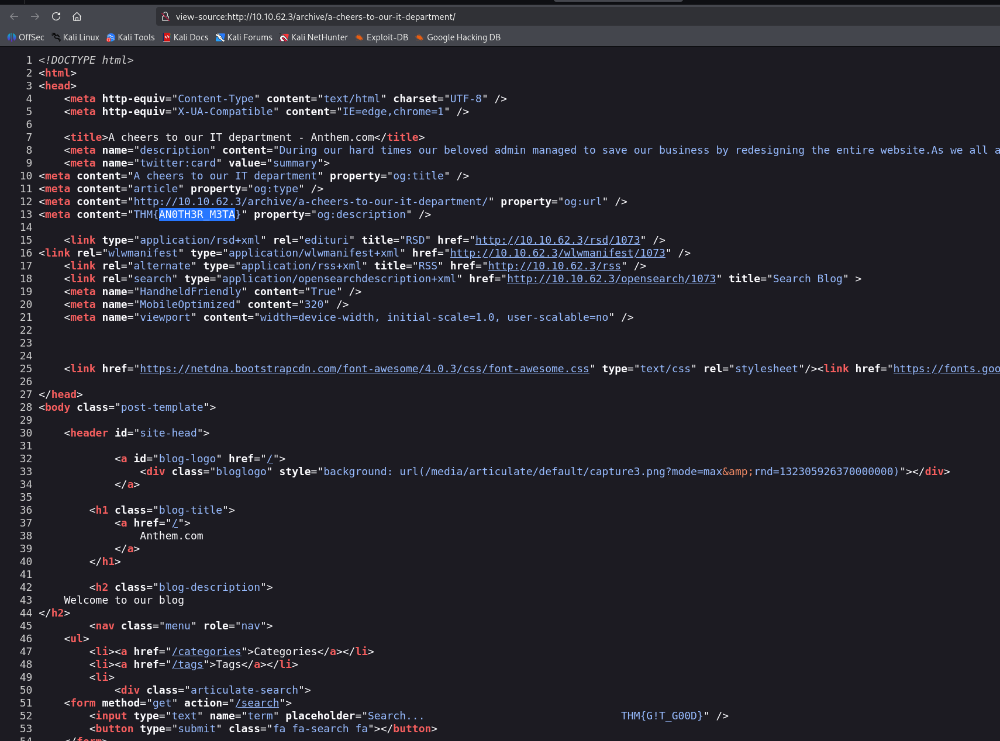
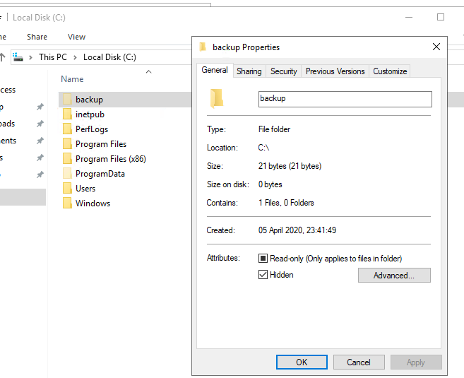
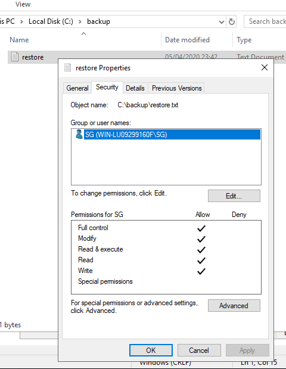

## Nmap Scan

An Nmap scan shows the following open ports:

```
┌──(kali㉿kali)-[~]
└─$ nmap --vv -p- -Pn -T4 10.10.62.3
--snip--
Discovered open port 3389/tcp on 10.10.62.3
Discovered open port 80/tcp on 10.10.62.3
SYN Stealth Scan Timing: About 2.22% done; ETC: 12:44 (0:22:45 remaining)
--snip--
SYN Stealth Scan Timing: About 94.90% done; ETC: 12:33 (0:00:38 remaining)
Completed SYN Stealth Scan at 12:33, 758.32s elapsed (65535 total ports)
Nmap scan report for 10.10.62.3
Host is up, received user-set (0.31s latency).
Scanned at 2025-09-17 12:20:50 EDT for 759s
Not shown: 65533 filtered tcp ports (no-response)
PORT     STATE SERVICE       REASON
80/tcp   open  http          syn-ack ttl 124
3389/tcp open  ms-wbt-server syn-ack ttl 124

Read data files from: /usr/share/nmap
Nmap done: 1 IP address (1 host up) scanned in 758.42 seconds
           Raw packets sent: 131508 (5.786MB) | Rcvd: 29970 (6.120MB)
```

This answers the first 2 questions:

1. `What port is for the web server?` - 80
2. `What port is for remote desktop service?` - 3389

## Web Enumeration

3. `What is a possible password in one of the pages web crawlers check for?`
   Using gobuster to enumerate directories on the web server, we find a `robots.txt` file.
   The password is just sitting there in plain text: `UmbracoIsTheBest!`
   It also contains a link to the admin panel: `/umbraco`
4. `What CMS is the website using?` - Umbraco
   Answer was in `robots.txt`

5. `What is the domain of the website?` - anthem.com
   We can find this in the title of the webpage.

6. `What's the name of the Administrator` - Solomon Grundy
   Well this question, took me a while to figure out.
   I tried logging into the admin panel with the password + your default usernames, then I read this
   > In this room, you don't need to brute force any login page. Just your preferred browser and Remote Desktop.
   > So I RDP into the box using the password and the username `Administrator`, which also didn't work.

Went back to the web page to do the good old OSINT. There is a poem on one of the blog posts.


Searching this poem, shows a name: `Solomon Grundy`


7. `Can we find find the email address of the administrator?` - sd@anthem.com
   When I was doing "OSINT" for question 6, I found an email address on another blog post.
   
   Infering from this, the email address of the administrator is `sd@anthem.com`

## Flags

Well, as if these questions weren't enough, we also have to find 4 flags.
Thankfully, I was able to find them during the good old OSINT for question 6.

#### Flag 1

In the metadata of the article "We are hiring" is the first flag.

`THM{L0L_WH0_US3S_M3T4}`

#### Flag 2

Home page, Search input


`THM{G!T_G00D}`

#### Flag 3

Viewing the author of the "We are hiring" article, shows us the flag, in plain text.





`THM{L0L_WH0_D15}`

#### Flag 4

Similar to flag1, but on the other article, "A cheers to our IT department"


`THM{AN0TH3R_M3TA}`

## Privilege Escalation

Getting back on the grind, you can RDP into the box using the password and the username `SG`.

```
──(kali㉿kali)-[~]
└─$ xfreerdp3 /u:"SG"  /p:UmbracoIsTheBest! /v:10.10.62.3
```

1. `Gain initial access to the machine, what is the contents of user.txt?` - `THM{N00T_NO0T}`

2. `Can we spot the admin password?` - `[REDACTED]`
   This took me a while to find.
   There is a hidden folder in `C:\Users` called `backup`.
   

Inside, there is a file called `restore.txt` which contains the admin password in plain text. However you need to add yourself in the security tab to be able to read it.


3. `Escalate your privileges to root, what is the contents of root.txt?` - `[REDACTED]`
   Either visit the Administrator profile, use `runas` command to open a cmd as administrator, or simply RDP into the box using the admin credentials.
   Flag is in `C:\Users\Administrator\Desktop\root.txt`
